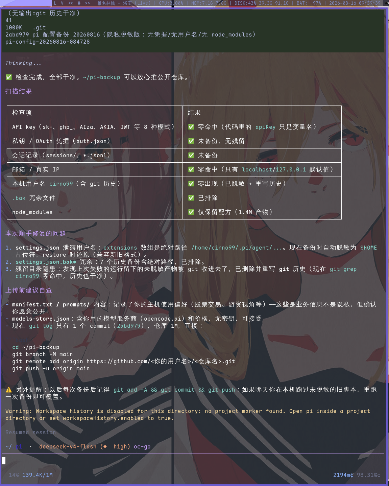

# pi-backup

pi 配置的备份 / 恢复方案：一键备份 `~/.pi/agent/` 核心配置（**不含私密信息**），可放心推到 GitHub（建议私有仓库）；换机时一条命令还原全部环境。

## 目录结构

```
pi-backup/
├── backup-pi.sh                  # 备份脚本（生成新的备份产物）
├── restore-pi.sh                 # 恢复脚本（随备份产物一起入库）
├── RESTORE.md                    # 备份 / 恢复 / 推送 GitHub 的完整说明
├── README.md                     # 本文档
├── docs/
│   └── screenshots/
│       └── privacy-check.png     # 隐私脱敏检查结果截图
└── pi-config-<时间戳>/           # 备份产物（每次备份生成一个目录）
    ├── manifest.txt              # 备份清单：时间、版本、包列表、技能列表、排除项
    ├── RESTORE.md                # 恢复说明副本
    ├── restore-pi.sh             # 恢复脚本副本（随备份走，解压即用）
    ├── excludes.txt              # 排除清单副本（rsync --exclude-from 格式）
    ├── acp.json                  # billion-context-pi 全局配置（~/.pi/acp.json，agent 目录外，有则备份）
    └── agent/                    # ~/.pi/agent 的核心配置子集
        ├── settings.json         # 主配置（扩展路径已脱敏为 $HOME 占位符）
        ├── AGENTS.md             # 全局开发约定
        ├── pi-lsp.json           # LSP 服务器配置（rust-analyzer / gopls / clangd / zls）
        ├── subagents.json        # 子代理配置
        ├── models-store.json     # 模型服务商与价格缓存
        ├── prompts/              # 提示词模板
        ├── extensions/           # 扩展源码（见下方"使用的扩展"）
        ├── compiled/             # 扩展编译产物 + update-extensions.sh 打包脚本
        ├── themes/               # 主题（catppuccin-macchiato / deep-purple / tokyo-night-dark）
        ├── npm/                  # 扩展依赖配方（package.json + bun.lock，node_modules 不备份）
        ├── fff/                  # pi-fff 索引缓存（frecency / history 的 LMDB）
        ├── git/                  # 各扩展的 git 状态缓存
        └── pi-cache-optimizer-stats.d/  # pi-cache-optimizer 统计分片
```

## 脚本作用

| 脚本 | 作用 |
|---|---|
| `backup-pi.sh` | 把 `~/.pi/agent/` 备份到 `pi-config-<时间戳>/`。自动排除私密/可重建内容（登录凭据、会话记录、node_modules、技能、ACP 运行日志），并把 `settings.json` 里的绝对路径脱敏为 `$HOME` 占位符，最后生成 `manifest.txt`。agent 目录外的 `~/.pi/acp.json`（billion-context-pi 全局配置）会一并复制到产物根目录。支持 `PI_TAR=1` 打包成 tar.gz、`PI_BACKUP_ROOT` 指定备份根目录 |
| `restore-pi.sh` | 从备份目录或 tar.gz 恢复：先移走现有 `~/.pi`（防覆盖）→ 复制核心配置 → 还原 `acp.json` 到 `~/.pi/acp.json` → 还原 `settings.json` 中的真实路径 → 按配方重建扩展环境（`pi install` + `bun ci --omit=peer` + bun 重新打包编译产物）→ 提示后续手动步骤（重新登录等） |
| `compiled/update-extensions.sh` | 扩展打包脚本：把 `extensions/` 下的源码 + npm/ 目录依赖 bundle 成 `compiled/*.js`（settings.json 引用的就是这些产物）。`--build-only` 只重打包不检查更新，pi 升级后建议重跑一次 |

## 工具链与前置要求

各脚本的运行依赖如下（备份机与恢复机可能不同，已分开标注）：

| 工具 | 备份 | 恢复 | 说明 |
|---|---|---|---|
| `pi` | 可选 | **必需** | 恢复脚本会校验存在并提示版本；建议与备份同版本（见 `manifest.txt` 的版本号）。用 `mise use -g pi@<版本>` 安装 |
| `rsync` | **必需** | **必需** | 备份/恢复核心配置。缺失时 `backup-pi.sh` 会直接报错退出 |
| `python3` | 必需 | 必需 | 解析 `settings.json`、生成 `manifest.txt`、修正/还原扩展绝对路径、注册 pi 包 |
| `bun` | — | **必需** | 恢复时按 `npm/package.json` + `bun.lock` 执行 `bun ci --omit=peer` 重建 node_modules（约 110M，需联网；`--omit=peer` 跳过 @earendil-works/pi-* 等由 pi 宿主注入的 peer 依赖，与 pi 安装参数一致）；同时用于重新打包扩展编译产物（`update-extensions.sh --build-only`）。npmCommand 已切换为 bun，pi 装包也依赖它，缺失时恢复脚本直接报错。建议与备份时同版本 |
| `tar` | 打包时 | 解压时 | 仅 `PI_TAR=1` 打包 / 恢复 tar.gz 备份时需要 |

> **备份机**只负责生成产物，只需 `rsync` + `python3`（外加可选的 `pi` 用于记录版本号）。
> **恢复机**的完整要求：`pi`、`rsync`、`python3`、`bun`。
>
> `update-extensions.sh` 的依赖：完整流程需要 `pi` + `bun`（联网更新依赖）；`--build-only` 只需 `bun`，不需要网络。

> 备份产物目录里也含 `RESTORE.md`、`restore-pi.sh`、`excludes.txt` 副本（以及可选的 `acp.json`），即使脱离仓库单独分发 tar.gz 也能完整恢复。

## 使用的扩展

`settings.json` 通过 `extensions` 数组加载 `compiled/` 下的编译产物；`packages` 列表由 `pi install` 注册；`npm/` 的配方则保证 node_modules 可按 `bun.lock` 精确复现。

### 编译产物加载的扩展（`compiled/*.js`）

| 扩展 | 作用 |
|---|---|
| `pi-statusline.js` | 信息丰富的状态栏（上下文占用、流式 CPS、缓存命中率、成本、模型信息、git 分支等），本地维护版 |
| `pi-readseek.js` | ReadSeek 工具组：带 LINE:HASH 锚点的文件读写 / 搜索 / 符号导航（覆盖内置 read / edit / write） |
| `@juicesharp-rpiv-web-tools.js` | Web 工具：联网搜索与网页抓取 |
| `pi-rtk-optimizer.js` | 输出优化：精简冗余输出、压缩无关内容、节省 token |
| `@juicesharp-rpiv-ask-user-question.js` | 结构化提问：多选项问卷，处理需求模糊的场景 |
| `@narumitw-pi-btw.js` | 运行中通知（标题栏 / 声音提示） |
| `@narumitw-pi-lsp.js` | LSP 集成：诊断、代码修复（配合 `pi-lsp.json` 的服务器配置） |
| `pi-cache-optimizer.js` | 缓存优化：提升 prompt 缓存命中率、降低成本 |
| `billion-context-pi.js` | ACP 上下文管理：`compress` / `decompress` / `search_context` / `acp_status` 自动压缩会话、`acp_delegate` 子代理委托。全局配置 `~/.pi/acp.json`、日志 `~/.pi/acp.log`（均在 agent 目录外，由备份脚本单独处理） |
| `pi-command-code-provider.js` | 注册 `command-code` provider（OpenAI 兼容端点 `/v1/chat/completions`），模型目录每次会话启动实时拉取，本地维护版 |

### pi 包（`packages`，`pi install` 安装）

| 包 | 作用 |
|---|---|
| `@ff-labs/pi-fff` | 文件模糊搜索（`fffind` / `ffgrep`），按访问频率排序 |
| `pi-context-usage` | 上下文用量统计 |
| `@tifan/pi-preferred-thinking` | 按模型设定默认思考级别（配合 `extensions/pi-preferred-thinking.json`） |
| `pi-workspace-history` | 工作区历史记录 |
| `pi-init` | 项目初始化脚手架（skills / 自定义 agent 模板） |
| `pi-session-name` | 会话命名 |
| `pi-md-export` | 将会话导出为 Markdown |

> 扩展依赖的 node_modules（约 110M）不备份，恢复时靠 `npm/` 配方 `bun ci --omit=peer` 重建；`extensions/` 源码目录保留完整注释与文档，便于二次开发。

## 隐私安全

备份产物不含任何私密信息，已自动处理：

- **排除**：登录凭据（`auth.json`）、会话记录、API key（仅存在于环境变量）、node_modules、技能内容、ACP 运行日志（`acp.log` / `acp-state/`）
- **脱敏**：`settings.json` 中扩展的绝对路径替换为 `$HOME` 占位符，恢复时自动还原（换用户名也有效）
- **自查**：上传前可对照下方截图检查确认



## 快速开始

```bash
# 备份
cd ~/pi-backup
./backup-pi.sh            # 生成 pi-config-<时间戳>/
PI_TAR=1 ./backup-pi.sh   # 或打包成单个 tar.gz

# 恢复（新机器，pi 已安装）
./restore-pi.sh pi-config-<时间戳>/
```

完整操作（推 GitHub、恢复到新机器、常见问题）见 [RESTORE.md](RESTORE.md)。
